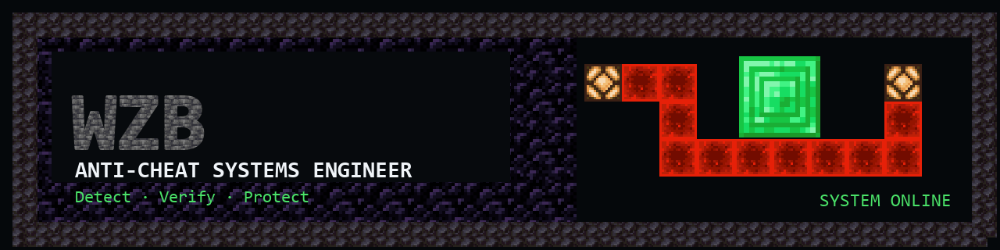
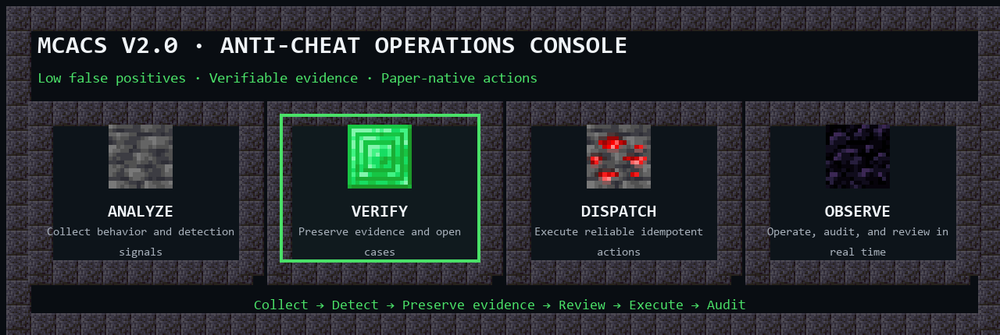

<div align="center">

<picture>
  <source media="(max-width: 600px)" srcset="./assets/profile/banner-en-mobile.png">
  
</picture>

<br>

[](./README.md)
[](./README-en.md)
[](https://github.com/wzbis666?tab=followers)

**Minecraft server security × anti-cheat operations × full-stack systems**

I build server-side detection, verifiable evidence pipelines, and operator consoles to make anti-cheat systems more accurate, transparent, and easier to run.

[Flagship](#flagship) · [Toolkit](#toolkit) · [Selected builds](#selected-builds) · [Contact](#contact)

</div>

## STATUS

- Building **[MCACS V2.0](https://github.com/wzbis666/MCACS-V2.0)**, an open-source anti-cheat operations console for Paper servers.
- Focused on **behavior detection, evidence engineering, reliable actions, low-false-positive policy, and real-time visualization**.
- Working mainly with **TypeScript, Java, Python, and Vue**, shipping deployable systems with Docker.
- Design principle: collect trustworthy signals, verify the evidence, then execute auditable actions.

## FLAGSHIP

<a href="https://github.com/wzbis666/MCACS-V2.0">
  <picture>
    <source media="(max-width: 600px)" srcset="./assets/profile/mcacs-en-mobile.png">
    
  </picture>
</a>

### [MCACS V2.0 — Minecraft Anti-Cheat Operations Console](https://github.com/wzbis666/MCACS-V2.0)

MCACS connects Paper events, detection evidence, investigation cases, policy decisions, and operator actions into one traceable workflow. A Paper plugin collects signals and executes actions, a Node.js control layer manages evidence and policy, and a Three.js console provides real-time visualization.

[](https://github.com/wzbis666/MCACS-V2.0/actions/workflows/ci.yml)
[](https://github.com/wzbis666/MCACS-V2.0/releases/latest)
[](https://github.com/wzbis666/MCACS-V2.0/blob/main/docs/COMPATIBILITY.md)
[](https://github.com/wzbis666/MCACS-V2.0/pkgs/container/mcacs)
[](https://github.com/wzbis666/MCACS-V2.0/blob/main/LICENSE)

- Detection intake: Grim events plus independent X-Ray analysis, normalized into seven behavior categories.
- Evidence and cases: time-window buffers, evidence timelines, investigation cases, and human review.
- Risk decisions: VP, player baselines, storm gates, grace periods, and hot-reloadable policy.
- Reliable actions: Paper ACK/NACK, retries, `actionId` idempotency, and reconnect synchronization.
- Operations UI: a Three.js 3D town, case panels, evidence playback, audit trails, and mobile controls.

[Source](https://github.com/wzbis666/MCACS-V2.0) · [Latest release](https://github.com/wzbis666/MCACS-V2.0/releases/latest) · [Deployment guide](https://github.com/wzbis666/MCACS-V2.0/blob/main/DEPLOY.md) · [Contributing](https://github.com/wzbis666/MCACS-V2.0/blob/main/CONTRIBUTING.md)

## TOOLKIT

<div align="center">

[](https://skillicons.dev)

`TypeScript` · `Java` · `Python` · `Vue` · `Node.js` · `Vite` · `Docker` · `Git` · `PowerShell`

</div>

## ACTIVE LOG

```text
[ PROCESSING ] Expanding movement, combat, and inventory detection modules
[ VERIFIED   ] Strengthening evidence timelines, case review, and audit boundaries
[ ACTION     ] Improving Paper action reliability, idempotency, and reconnect sync
[ MONITORING ] Refining the real-time 3D console and mobile operator experience
```

## SELECTED BUILDS

### [Anti-cheat-system](https://github.com/wzbis666/Anti-cheat-system)

An earlier full-stack Minecraft server anti-cheat system with a Java plugin, Spring Boot backend, Vue admin console, real-time data, and Docker orchestration.

`Java` · `Spring Boot` · `Vue` · `MySQL` · `Docker`

### [home-page](https://github.com/wzbis666/home-page)

A responsive personal homepage built with Vue, Vuetify, and Vite, with configurable themes, backgrounds, music, and online deployment.

`Vue` · `Vuetify` · `Vite` · `Vercel`

## ACTIVITY

<div align="center">

<picture>
  <source media="(prefers-color-scheme: dark)" srcset="https://raw.githubusercontent.com/wzbis666/wzbis666/output/github-snake-dark.svg">
  <source media="(prefers-color-scheme: light)" srcset="https://raw.githubusercontent.com/wzbis666/wzbis666/output/github-snake.svg">
  
</picture>

</div>

<details>
<summary><strong>BEYOND CODE</strong></summary>

I enjoy Minecraft survival, redstone engineering, and server ecosystems, as well as science-fiction and crime films. Some favorites are *Inception*, *The Matrix*, *Interstellar*, *The Godfather*, and *Blade Runner 2049*.

> From placing blocks to protecting servers.

</details>

## CONTACT

- GitHub: [@wzbis666](https://github.com/wzbis666)
- Email: [3378621722@qq.com](mailto:3378621722@qq.com)

---

<div align="center">

This profile combines selected vanilla Minecraft Java Edition textures with original layouts and typography. The repository does not distribute the game client or a raw resource pack.

**NOT AN OFFICIAL MINECRAFT PRODUCT. NOT APPROVED BY OR ASSOCIATED WITH MOJANG STUDIOS OR MICROSOFT.**

The Minecraft name, brand, and game assets belong to their respective rights holders.

</div>
