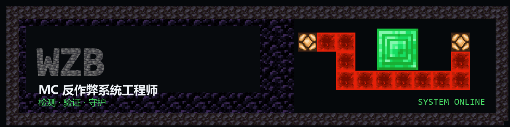
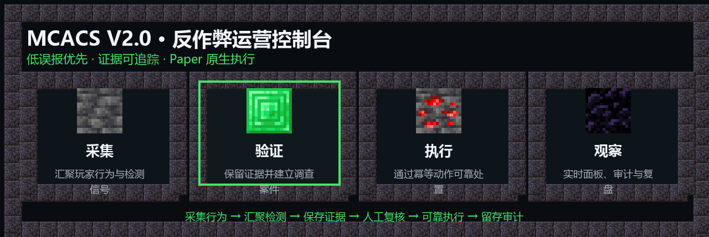

<div align="center">

<picture>
  <source media="(max-width: 600px)" srcset="./assets/profile/banner-cn-mobile.png">
  
</picture>

<br>

[](./README.md)
[](./README-en.md)
[](https://github.com/wzbis666?tab=followers)

**Minecraft 服务器安全 × 反作弊运营 × 全栈系统**

我构建服务端检测、可验证证据链与管理员控制台，目标是让反作弊更准确、透明，也更容易运营。

[旗舰项目](#flagship--旗舰项目) · [技术栈](#toolkit--技术栈) · [其他项目](#selected-builds--其他项目) · [联系我](#contact--联系我)

</div>

## STATUS / 当前坐标

- 正在开发 **[MCACS V2.0](https://github.com/wzbis666/MCACS-V2.0)**：面向 Paper 服务器的开源反作弊运营控制台。
- 关注 **行为检测、证据工程、可靠执行、低误报策略与实时可视化**。
- 主要使用 **TypeScript、Java、Python 与 Vue**，并通过 Docker 交付可部署系统。
- 设计原则：先收集可信信号，再验证证据，最后执行可审计动作。

## FLAGSHIP / 旗舰项目

<a href="https://github.com/wzbis666/MCACS-V2.0">
  <picture>
    <source media="(max-width: 600px)" srcset="./assets/profile/mcacs-cn-mobile.png">
    
  </picture>
</a>

### [MCACS V2.0 — Minecraft Anti-Cheat Operations Console](https://github.com/wzbis666/MCACS-V2.0)

MCACS 将 Paper 事件、检测证据、调查案件、策略决策和管理员操作串成一条可追踪的运营流程。Paper 插件负责采集与动作执行，Node.js 控制层负责证据、案件和策略，Three.js 管理界面负责实时可视化。

[](https://github.com/wzbis666/MCACS-V2.0/actions/workflows/ci.yml)
[](https://github.com/wzbis666/MCACS-V2.0/releases/latest)
[](https://github.com/wzbis666/MCACS-V2.0/blob/main/docs/COMPATIBILITY.md)
[](https://github.com/wzbis666/MCACS-V2.0/pkgs/container/mcacs)
[](https://github.com/wzbis666/MCACS-V2.0/blob/main/LICENSE)

- 检测接入：Grim 事件与独立 X-Ray 分析，统一映射七类行为。
- 证据与案件：时间窗口缓冲、证据时间线、调查案件和人工复核。
- 风险决策：VP、玩家基线、风暴门控、宽限策略与热重载配置。
- 可靠执行：Paper ACK/NACK、重试、`actionId` 幂等和状态同步。
- 运营界面：Three.js 3D 城镇、案件面板、回放、审计与移动端控制。

[查看源码](https://github.com/wzbis666/MCACS-V2.0) · [最新版本](https://github.com/wzbis666/MCACS-V2.0/releases/latest) · [部署指南](https://github.com/wzbis666/MCACS-V2.0/blob/main/DEPLOY.md) · [参与贡献](https://github.com/wzbis666/MCACS-V2.0/blob/main/CONTRIBUTING.md)

## TOOLKIT / 技术栈

<div align="center">

[](https://skillicons.dev)

`TypeScript` · `Java` · `Python` · `Vue` · `Node.js` · `Vite` · `Docker` · `Git` · `PowerShell`

</div>

## ACTIVE LOG / 当前工作

```text
[ PROCESSING ] 扩展移动、战斗与库存行为的检测模块
[ VERIFIED   ] 强化证据时间线、案件复核与审计边界
[ ACTION     ] 优化 Paper 动作可靠性、幂等与重连同步
[ MONITORING ] 打磨实时 3D 控制台与移动端操作体验
```

## SELECTED BUILDS / 其他项目

### [Anti-cheat-system](https://github.com/wzbis666/Anti-cheat-system)

早期 Minecraft 服务器反作弊全栈方案，包含 Java 插件、Spring Boot 后端、Vue 管理面板、实时数据与 Docker 编排。

`Java` · `Spring Boot` · `Vue` · `MySQL` · `Docker`

### [home-page](https://github.com/wzbis666/home-page)

基于 Vue、Vuetify 与 Vite 的响应式个人主页，支持主题、背景、音乐与在线部署配置。

`Vue` · `Vuetify` · `Vite` · `Vercel`

## ACTIVITY / GitHub 动态

<div align="center">

<picture>
  <source media="(prefers-color-scheme: dark)" srcset="https://raw.githubusercontent.com/wzbis666/wzbis666/output/github-snake-dark.svg">
  <source media="(prefers-color-scheme: light)" srcset="https://raw.githubusercontent.com/wzbis666/wzbis666/output/github-snake.svg">
  
</picture>

</div>

<details>
<summary><strong>BEYOND CODE / 代码之外</strong></summary>

我喜欢 Minecraft 生存、红石工程和服务器生态，也会看科幻与犯罪电影。喜欢的作品包括《盗梦空间》《黑客帝国》《星际穿越》《教父》和《银翼杀手 2049》。

> From placing blocks to protecting servers.

</details>

## CONTACT / 联系我

- GitHub：[@wzbis666](https://github.com/wzbis666)
- 邮箱：[3378621722@qq.com](mailto:3378621722@qq.com)

---

<div align="center">

本主页使用选定的 Minecraft Java Edition 原版材质与原创排版合成视觉资产；仓库不分发游戏客户端或原始资源包。

**本主页不是 Minecraft 官方产品，未经 Mojang Studios 或 Microsoft 认可，也与其无关联。**

Minecraft 名称、品牌与游戏资产归其各自权利人所有。

</div>
